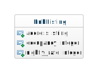
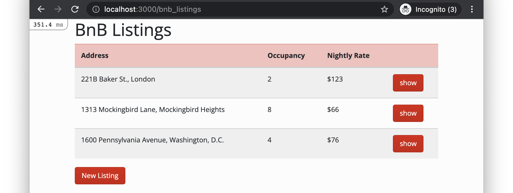
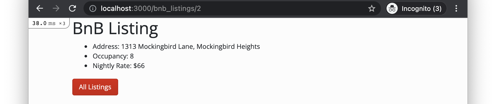
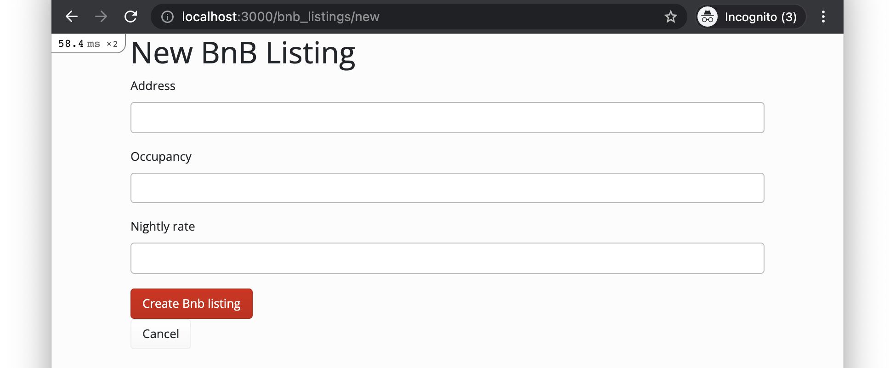
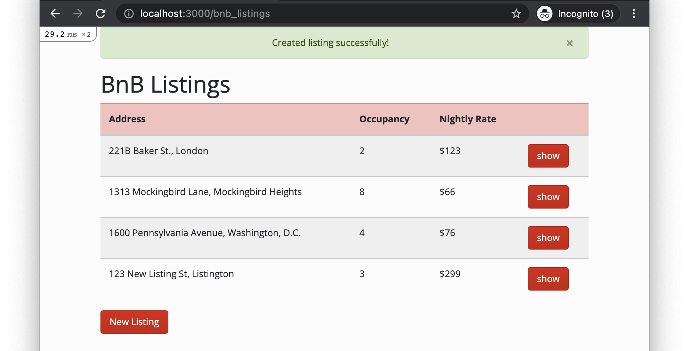
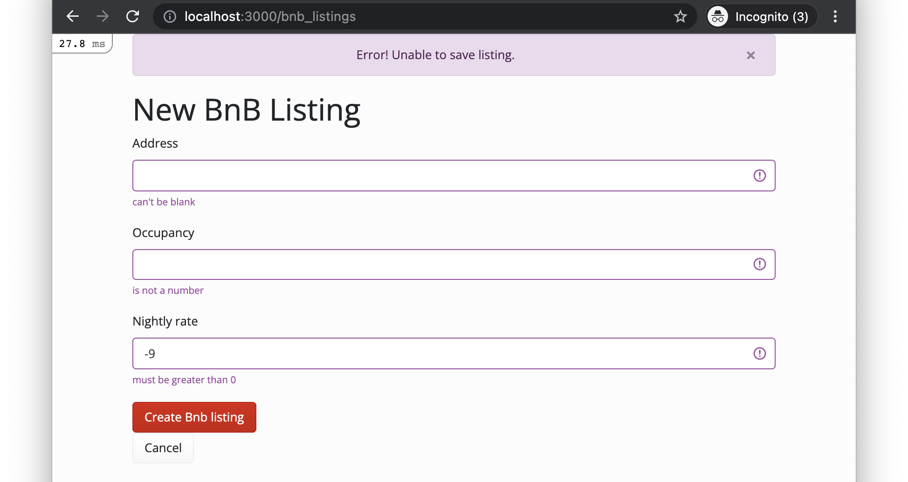

# Skills Test ST1

## Part 1. Starting the Test

1. Start the screen-capture recording.

2. In your web browser, google the query string "`current time`", so the current time is displayed and captured in the recording.

3. If you haven't already done so, perform the "Preparing for the Test" steps, listed [here](https://human-se.github.io/softw-eng-course-materials/2021-08fall/skills-tests.html#preparing-for-the-test).

## Part 2. Development Tasks

### Task 1. Create a Model Class

Create a model class `BnbListing` that is structured like this:



### Task 2. Add Model Attribute Validations

Add model attribute validations such that the following properties are ensured:

- `address` must be present (i.e., non-`nil` and non-blank).
- `occupancy` must be greater than 0.
- `nightly_rate` must be greater than 0.

### Task 3. Add Database Seeds

Update and run the seeds script such that the database is seeded with the following data:

| `address` | `occupancy` | `nightly_rate` |
| --------- | ----------- | -------------- |
| 221B Baker St., London | 2 |  123 |
| 1313 Mockingbird Lane, Mockingbird Heights | 8 | 66 |
| 1600 Pennsylvania Avenue, Washington, D.C. | 4 | 76 |

### Task 4. Add Index, Show, and New/Create Resource Pages and Features

1. Add a typical index resource page that looks like this:

   

2. Add typical show resource pages that look like this:

   

   The "show" buttons on the index page should link to the appropriate show pages.

   The "All Listings" button at the bottom of the show pages should link back to the index page.

3. Add a typical new/create resource form page that looks like this:

   

   The "Cancel" button should link to the index page.

   If the form data is saved successfully, the user should be redirected to the index page, and  a flash notification should be displayed, like this:

   

   If the user submits invalid data in the form, the form should be redisplayed with the user-entered data and error messages, like this:

   

**Important!** The base app already has flash-notification infrastructure, as described in the [flash notification deets page](https://rails-demos-n-deets-2022.herokuapp.com/deets/flash-notifications).

**Important!** Implement things in the same way they were implemented in the [Demos-n-Deets](https://rails-demos-n-deets-2022.herokuapp.com/).

**Important!** Don't waste time trying to get the CSS styling just right.

**Important!** Submit your code and video regardless of whether you completed all tasks successfully.

## Part 3. Test Submission

Submit your work by doing the following:

1. Commit all your changes to the local repo:

    ```bash
    git add -A
    ```

    ```bash
    git commit -m "Completed ST1"
    ```

1. Generate a ZIP archive of your project by running the following command from within the top-level folder of your project's working directory:

    ```bash
    git archive -o ../st1-submission.zip --prefix=st1-submission/ HEAD
    ```

    This command should result in a file `st1-submission.zip` being created in your `workspace` folder.

1. Upload this ZIP file to the [eCourseware](https://elearn.memphis.edu/) dropbox labeled `ST1 Code (no video)`.

    **This step must be completed by the end of the test time.**

1. Stop your screen-capture recording such that a video file containing the recording is now created.

1. Upload your video recording to the [eCourseware](https://elearn.memphis.edu/) dropbox labeled `ST1 Video Only`. Click the "`Record Video`" link to upload your video.

    A 1-hour grace period is given beyond the end of the test time for the submission of your video.

1. Close your laptop, and sit quietly until the test period is over. You may **NOT** use your laptop or any device while you wait. However, you may, for example, read a book that you brought with you.
